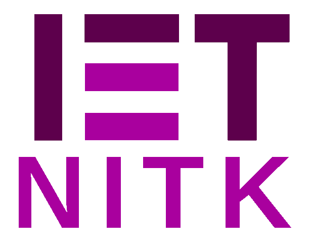

<!--
*** Thanks for checking out the Best-README-Template. If you have a suggestion
*** that would make this better, please fork the repo and create a pull request
*** or simply open an issue with the tag "enhancement".
*** Don't forget to give the project a star!
*** Thanks again! Now go create something AMAZING! :D
-->

<!-- PROJECT SHIELDS -->
<!--
Project README taken from https://github.com/othneildrew/Best-README-Template, with some modifications. Thank you!
-->
[![Contributors][contributors-shield]][contributors-url]
[![Forks][forks-shield]][forks-url]
[![Stargazers][stars-shield]][stars-url]
[![Issues][issues-shield]][issues-url]
[![MIT License][license-shield]][license-url]
[![LinkedIn][linkedin-shield]][linkedin-url]

<!-- PROJECT LOGO -->
 

  

  <h3 align="center">Official IET NITK Website</h3>

  

    One place to explore everything built by IET NITK 💪✨✨
     
    <a href="https://github.com/IET-NITK/IET-NITK.github.io/wiki"><strong>Explore the docs »</strong></a>
     
     
    <a href="https://iet.nitk.ac.in">View Online</a>
    ·
    <a href="https://github.com/IET-NITK/IET-NITK.github.io/issues">Report Bug</a>
    ·
    <a href="https://github.com/IET-NITK/IET-NITK.github.io/issues">Request Feature</a>
  

<!-- TABLE OF CONTENTS -->

  
Table of Contents

  <ol>
    <li>
      <a href="#about-the-project">About The Project</a>
      <ul>
        <li><a href="#built-with">Built With</a></li>
      </ul>
    </li>
    <li>
      <a href="#getting-started">Getting Started</a>
      <ul>
        <li><a href="#prerequisites">Prerequisites</a></li>
        <li><a href="#installation">Installation</a></li>
      </ul>
    </li>
    <li><a href="#contributing">Contributing</a></li>
    <li><a href="#contributors">Contributors</a></li>
    <li><a href="#license">License</a></li>
    <li><a href="#contact">Contact</a></li>
  </ol>

<!-- ABOUT THE PROJECT -->
## About The Project
Our group has grown exponentially over the years, and to keep a track of and spread our activities, we have built this website. 

(<a href="#top">back to top</a>)

### Built With

Following are some of the popular libraries/ frameworks we used: 

* [React.js](https://reactjs.org/)
* [Gatsby](https://reactjs.org/)
* [Lodash](https://reactjs.org/)
* [Bootstrap](https://getbootstrap.com)
* [JQuery](https://jquery.com)

(<a href="#top">back to top</a>)

<!-- GETTING STARTED -->
## Getting Started

This is an example of how you may give instructions on setting up your project locally.
To get a local copy up and running follow these simple example steps.

### Prerequisites

### Installation

(<a href="#top">back to top</a>)

<!-- CONTRIBUTING -->
## Contributing

Contributions are what make the open source community such an amazing place to learn, inspire, and create. Any contributions you make are **greatly appreciated**.

If you have a suggestion that would make this better, please fork the repo and create a pull request. You can also simply open an issue with the tag "enhancement".
Don't forget to give the project a star! Thanks again!

1. Fork the project
2. Create your Feature Branch (`git checkout -b feature/AmazingFeature`)
3. Commit your Changes (`git commit -m 'Add some AmazingFeature'`)
4. Push to the Branch (`git push origin feature/AmazingFeature`)
5. Open a Pull Request

(<a href="#top">back to top</a>)

## Contributors
Obviously, the content on the website is thanks to every single current or alumni member of IET NITK (see them all [here](https://iet.nitk.ac.in/about/)). But we do have a lot of skillfull people (from both IET NITK and GitHub in general) who've built the framework and the structure where that content is displayed, and we're really grateful to them:
<!-- readme: contributors -start -->
<table>
<tr>
    <td align="center">
        <a href="https://github.com/nirmalhk7">
            
             
            <b>Nirmal Khedkar</b>
        </a>
    </td>
    <td align="center">
        <a href="https://github.com/renovate-bot">
            
             
            <b>WhiteSource Renovate</b>
        </a>
    </td>
    <td align="center">
        <a href="https://github.com/Madhan-Kumar22">
            
             
            <b>Madhan-Kumar22</b>
        </a>
    </td>
    <td align="center">
        <a href="https://github.com/gaurav-chaurasia">
            
             
            <b>Gaurav Chaurasia</b>
        </a>
    </td>
    <td align="center">
        <a href="https://github.com/ImgBotApp">
            
             
            <b>Imgbot</b>
        </a>
    </td></tr>
<tr>
    <td align="center">
        <a href="https://github.com/rj-since-2000">
            
             
            <b>Rajan Jaiswal</b>
        </a>
    </td></tr>
</table>
<!-- readme: contributors -end -->
<!-- readme: bots -start -->
<table>
<tr>
    <td align="center">
        <a href="https://github.com/renovate[bot]">
            
             
            <b>renovate[bot]</b>
        </a>
    </td></tr>
</table>
<!-- readme: bots -end -->

 

<!-- LICENSE -->
## License

Distributed under the MIT License. See `LICENSE.md` for more information.

(<a href="#top">back to top</a>)

<!-- CONTACT -->
## Contact
<!-- If you're reading this as a Web Admin of IET NITK, and this information isnt updated, please update it so. -->
Nirmal Khedkar - nirmalhk7@gmail.com

(<a href="#top">back to top</a>)

<!-- MARKDOWN LINKS & IMAGES -->
<!-- https://www.markdownguide.org/basic-syntax/#reference-style-links -->
[contributors-shield]: https://img.shields.io/github/contributors/IET-NITK/IET-NITK.github.io.svg?style=for-the-badge
[contributors-url]: https://github.com/IET-NITK/IET-NITK.github.io/graphs/contributors
[forks-shield]: https://img.shields.io/github/forks/IET-NITK/IET-NITK.github.io.svg?style=for-the-badge
[forks-url]: https://github.com/IET-NITK/IET-NITK.github.io/network/members
[stars-shield]: https://img.shields.io/github/stars/IET-NITK/IET-NITK.github.io.svg?style=for-the-badge
[stars-url]: https://github.com/IET-NITK/IET-NITK.github.io/stargazers
[issues-shield]: https://img.shields.io/github/issues/IET-NITK/IET-NITK.github.io.svg?style=for-the-badge
[issues-url]: https://github.com/IET-NITK/IET-NITK.github.io/issues
[license-shield]: https://img.shields.io/github/license/IET-NITK/IET-NITK.github.io.svg?style=for-the-badge
[license-url]: /LICENSE.md
[linkedin-shield]: https://img.shields.io/badge/-LinkedIn-black.svg?style=for-the-badge&logo=linkedin&colorB=555
[linkedin-url]: https://linkedin.com/in/IET-NITK
[product-screenshot]: images/screenshot.png

