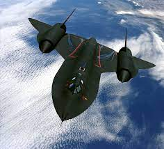
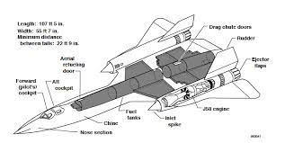
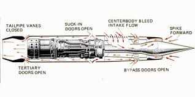

# Insane Engineering Of Sr71

##### *BY  ROHIT BEHERA - JULY 13TH, 2022*

It’s hard to explain the engineering marvel that is the SR-71 Blackbird. A long-range plane capable of flying 26 kilometers above the surface of the planet. So high that the pilots could see the curvature on the planet and the inky black of space from their cockpits. It flew so fast that the engineers had to develop entirely new materials and designs to mitigate and dissipate the heat generated from aerodynamic friction. Unique engines were needed to function from 0 up to Mach 3.2, dealing with a myriad of problems like cooling, fuel efficiency, and supersonic shock waves interfering with airflow. A plane so advanced that when it detected a surface-to-air missile its response was simply to change course and speed up. Even though the missiles had a higher top speed, they couldn’t achieve the range and high altitude maneuverability the Blackbird could. A speed at which the SR-71 could cruise for extended periods.

How on earth did it manage that? To achieve those kinds of speeds a ramjet is typically needed. A ramjet, as you can probably guess from the name, relies on ram pressure to operate. Ram Pressure is simply the pressure that occurs as a plane rams itself through the air. So, as the engine moves through the sky, it funnels this high-pressure air inside. Before entering the combustion chamber the supersonic airflow must first be slowed down. This acts as the compressor stage of a normal jet engine, elevating the air pressure before it enters the combustion chamber. Once the air enters the combustion chamber, It is mixed with fuel and ignited. It expands and accelerates once again out of the exit nozzle. With no moving parts, this type of engine is capable of flying at speeds far greater than a typical turbine-driven engine, but it cannot start from zero. It needs forward movement to achieve the correct compression of air in the combustion chamber. So, they are either dropped from a conventional plane, have a secondary propulsion system, or are a hybrid of a conventional jet engine and a ramjet, which is precisely what the SR-71 used.

The turbojet J58 engine of the SR-71 is nestled inside the nacelle here. In front and around The J58 is a complicated system of airflow management. These control mechanisms allow the propulsion system to transition from a primarily turbojet engine to a ramjet engine in mid-flight

First, the inlet spike. It is capable of moving forward and back by 0.66 meters. This adjusts the inlet and the throat area, which controls the airflow entering the engine. It also keeps the position of the normal shock wave at its ideal position between the inlet throat and the compressor, this is the most efficient position for the shock wave, as it minimizes the energy lost due to drag as air flows over the shock wave. The inlet spike stays in the forward position until Mach 1.6. After this point, it begins to move backward by 41 millimeters forever 0.1 increase in Mach number. Keeping the shock wave in its ideal position. The inlet spike contains perforations that connect to the outside of the nacelle through ducts. Initially, the flow of air will come from the outside in to provide additional airflow to the turbojet engines, but once the plane hits about Mach 0.5 this airflow reverses. As the plane speeds up the inlet spike develops a significant boundary layer of air. A boundary layer is a layer of very slow-moving air that clings to the surface of objects. By bleeding this layer of slow-moving air off to the inlet spike it frees up a greater area of the inlet area for high energy fast-moving air, and thus improves efficiency. Around the engine, there is a bypass area, which takes air from the inlet and bypasses it is around the J58 engine. This air was used to cool the J58, which again improved engine efficiency and allowed the plane to fly faster. After the air passes the engine it rejoins the airflow just after the engine afterburner, adding additional thrust as more oxygen becomes available for combustion and increases the pressure through the ejector nozzle. Air got into this bypass area in several ways. There was a shock trap, otherwise known as the cowl bleed, located here, which again helped minimize boundary layer growth. There were stuck-in doors, located here, which opened only from Mach 0 to Mach 0.5, to add additional air to the bypass for engine cooling.

Air from the aft bypass doors, located just before the J58 inlet, also fed into the bypass. These together with the forward bypass doors, which vented to the atmosphere were used to control the pressure level in the inlet at the optimum level. If it was getting too high a pressure sensor would trigger the forward bypass doors to open allowing more air to exit the inlet, while the aft bypass doors were controlled by the pilot. These doors played a critical role in maintaining the position of the normal shock wave. If this was mismanaged the engine would lose control of the normal shock wave and may even spit it out of the intake. Resulting in sudden power loss, called an unstart, which would cause the plane to violently yaw in the direction of the faulty engine. If this happened the forward bypass doors would open fully and the spike would move forward to reduce back-pressure and get the shock-wave back to its normal position. Besides this bypass area that took the air from the inlet and dumped it into the ejector, 6 bypass ducts took the air from the compressor and dumped it directly into the afterburner. These ducts were the primary mechanism that transformed the engine from a turbojet into a ramjet.

Afterburners are great, they significantly add to thrust without needing a whole lot of additional weight. They just inject fuel into the exhaust of a jet engine and ignite it with whatever oxygen is left to provide additional expansion and therefore thrust, but they are inefficient. However, as the speed increases, they are the only feasible way to generate thrust, and they do gain efficiency thanks to the forward motion providing the compression of air needed to run them, instead of the turbine needing to be powered to turn the compressor stage. The crazy thing about the SR-71 however, is that the engineers could have eked out more thrust from this engine to increase the top speed even more. Ramjets can go up to Mach 5.

So why did they stop at 3.2 mach? Would they have run out of fuel? Fuel efficiency in terms of cost doesn’t mean a whole lot to a military plane like this. The military doesn’t care about cost. But, the more fuel you carry the heavier and bigger the plane gets, increasing the fuel it uses. There is a break-even point and the range of the plane will be limited, but the engineers did manage to fill the plane up with an astounding amount of fuel with some clever engineering. The SR-71 used something called a total wet wing fuel tank system, which meant that the fuel was not contained within a separate fuel bladder. This was a weight-saving measure, separate metal fuel tanks would add too much weight and lighter plastic ones would melt from the intense heat generated from the aerodynamic friction. So, the fuel was contained by the skin of the plane itself. The engineers applied sealant to every gap the fuel could come out of, but because the titanium skin of the plane expanded and contracted with every flight gradually deteriorated over time. Allowing fuel to leak out. Because of this, the SR-71 had to regularly go into maintenance and have sealant reapplied, But it usually just came back still leaking, just not quite as much. The number of manhours required to reduce it to zero was simply too great to fit between flights, so they just had an allowable fuel leak limit.

This plane, like a rocket, was mostly fuel. Its dry weight, depending on the sensor. The paid load was between 25 tons and 27 tons. Its wet weight was 61 to 63 tons. Making It weighs 59% fuel to feed those hungry engines. Even then, without the ability to refuel in the air this plane would have had a terrible the range for what was supposed to be a long-range spy plane. The range varied greatly. For example, the engines became significantly less efficient when the outside temperatures were higher. A fully loaded SR-71 could expect to burn nearly 13 metric tons of fuel accelerating from Mach 1.25 at 30,000 feet to Mach 3.0 at 70,000 feet if the outside temperature was 10 degrees celsius above standard. That’s 36% of its fuel capacity. If it was 10 degrees below standard, the fuel burn nearly halved to 7.2 tons. And of course, the range was severely affected by their speed and use of the afterburner, but on average the SR-71 had a range of about 5,200 kilometers. The longest operational sortie occurred in 1987 when the US flew the SR-71 from Okinawa to observe developments in the Iran-Iraq war. This mission lasted 11.2 hours and likely required at least 5 aerial refuelings along the way. So, if it wasn’t the fuel or engines that limited the SR-71s top speed. What did?

At Mach 3.2 the nose of the SR-71 reached 300 degrees celsius, while the engine nacelles could reach 306 at the front and 649 at the back. This is what truly limited the top speed of the SR-71. Without careful material selection and design, the plane would simply overheat and fail. Even the fuel needed to be specially formulated to get around these overheating issues. It was a specially formulated fuel called JP7. Which had very low volatility with a high flash point. This was needed partially because the fuel leaked on the runway and they needed a fuel that wouldn’t ignite easily or evaporate and make the ground crew ill, but mostly they needed a fuel that wouldn’t vaporize in the tanks and cause fuel feed and pressurization problems. The JP7 fuel was so stable that it doubled as a coolant for the entire plane. The fuel was pumped around the airframe to cool critical components like the engine oil, hydraulic systems, and control electronics. When the fuel got too hot it was simply sent to the engines for combustion. The fuel was so stable that the plane needed to carry Triethylborane, a fuel that spontaneously ignites in the presence of oxygen, to start the combustion cycle and afterburners. The plane usually only carried about 16 shots of this, so the pilots needed to manage them carefully, particularly when slowing down for refueling or managing unstarts. One huge question I had about the SR-71 was why it was painted black. Airliners are all white to reflect heat and prevent the plane from overheating. If that applies to an airliner, Why not the SR-71?

The SR-71s predecessors were unpainted, which saved weight, and the areas exposed to the highest temperatures were painted black. Why was this? Surely black would absorb more heat? The Concorde was once painted blue for a Pepsi ad campaign and had to lower its speed, as it absorbed too much heat from the sun. However, the Concorde did not fly nearly as high or as fast as the SR-71, and as the SR-71 rose the energy is absorbed from the sun dwindled in comparison to the heat it gained from aerodynamic friction. For this, we have to refer to something called Kirchoff’s Rule of Radiation, which tells us that a good heat absorber, like a black object, is also an equally effective heat emitter. So, the black paint helped the SR-71 radiate heat away from the plane, as it allowed the plane to radiate more heat than it gained from radiation from the sun. These efforts helped keep the plane cool, but the structure of the plane still needed to incredibly heat stable. Aluminum is typically the material aircraft engineers turn to. It was used for the Concorde, but as we saw it too had its speed limited by heat to a much lower Mach 2. Aluminum is cheap, has a great strength-to-weight ratio, and is easily machinable.

Titanium, the material that made up 93% of the SR-71, has only one of these properties, Its strength-to-weight ratio, otherwise known as a specific strength, is fantastic. But, Titanium is incredibly expensive, despite it being the 7th most common metal in Earth’s crust. The refinement process is incredibly long and requires expensive consumables. It’s also not easily machinable as it readily reacts with air when welding or forging, becoming brittle. For these reasons, titanium is rarely used in structural parts in aviation. However, The real benefit of titanium is its ability to resist heat. The reasons for this are complex that we will explore in-depth in the future. However, the gist is that titanium alloys have incredibly strong bonding within their crystal lattice that resist heat from breaking them apart. Titanium alloys can resist temperatures up to 600 degrees Celcius before their atoms begin to diffuse and slide over each other significantly. Allowing it to retain much of its strength even at 300 degrees. It also has a very low thermal expansion, so that expansion and contraction we mentioned earlier are minimized. Reducing the thermal stresses in the aircraft. But Titanium too has its limits, and for the SR-71 this was about 3.2 Mach.

Today engineers have made huge strides in material science. The SR-71 used heat-resistant composite materials as radar-absorbing wedges between the structural frame, located in these locations. The manufacturing techniques needed to make composite materials as load-bearing structures did not yet exist, but that has changed. The SR-71s successor the SR-72, which is now in development, will take advantage of new high-performance composites, which will allow it to reach speeds up to Mach 6. Many of its engine components will likely be 3D printed titanium with cooling ducts printed right into the part. Its range also won’t be determined by pilots, as it will be an autonomous drone.

##### *WRITTEN BY  ROHIT BEHERA - JULY 13TH, 2022*