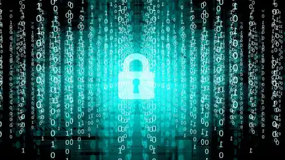

# Ai For Cybersecurity

##### *BY  SOMESH KARTIKEYA - JULY 30TH, 2022*

Cybercrime is becoming more common as technology advances, and it is also becoming more complex. Since the enterprise attack surface is so large, there are hundreds of billions of time-varying signals that must be accurately analysed to determine danger. Analyzing these billions of signals is not a human scale problem anymore.

As a result of this challenge, Artificial Intelligence (AI)-based cybersecurity technologies have emerged to assist information security teams in reducing breach risk and improving their security posture quickly and effectively. AI and machine learning (ML) have become key technologies in information security because they can easily examine millions of events and recognise a wide range of threats, such as detecting risky activity that could lead to a phishing attack or malicious code download.

# Implementation of AI for cybersecurity
AI has influenced security by assisting professionals in detecting network anomalies by observing user behaviour and analyzing patterns. Security professionals may also use artificial intelligence to analyse network data and identify vulnerabilities in order to prevent malicious attacks.

### **1)Using biometric logins**

Passwords are vulnerable to cyber attacks, according to several cybersecurity experts.Hence users' personal details, credit card information, and other sensitive information can be easily stolen. As a result of deploying AI for cybersecurity, biometric login strategies for safe logins have been implemented. AI systems will accurately scan fingerprints, retinas, and palm prints. Biometric logins can be used in combination with current passwords on devices such as smartphones for safe login.

### **2)Detecting threats and malicious activities**

As new malware pieces are being created every month. Traditional cybersecurity systems are ineffective in dealing with new malware forms. As a result, implementing AI for cybersecurity is a viable solution to such issues.

With the help of many datasets that include algorithms and codes, cybersecurity firms are teaching AI systems to detect malware and viruses. AI can use this data to perform pattern recognition, which aids in the detection of malicious software actions. Furthermore, AI and machine learning have the potential to play a critical role in online security. Website path traversals can be analyzed using machine learning to see whether they lead to malicious domains. Similarly, AI-based systems can detect malicious files and prevent them from infecting the device.

### **3)Securing conditional access**

Authentication models are often used by companies to protect sensitive information from unwanted people . If an employee or business leader with higher authentication privileges accesses such data remotely, the system can be hacked through the network. Traditional authentication models are less agile in these situations. Using AI for cybersecurity, on the other hand, would aid in the creation of a complex, real-time, and global authentication system that adjusts access privileges based on location or network.

### **4)Breach Risk Prediction**

AI-based systems will predict how and when you're most likely to be hacked, allowing you to allocate resources and tools to vulnerable areas. Prescriptive insights obtained from AI research will assist you in configuring and improving controls and processes to increase the organization's cyber resilience the most effectively.

# Limitations of Using AI for cybersecurity
While there are several advantages to using AI for cybersecurity, there are several drawbacks also-

1. Black hat hackers may use AI to test their own malware in the same way as ethical hackers and cybersecurity experts do. Hackers can evolve advanced malware or even AI-proof malware strains with constant testing.
2. For starters, creating and maintaining an AI-based system requires a significant amount of memory, processing power, and data.
3. Training data must be correct, since incorrect data can result in inefficient outcomes. As a result, locating and gathering specific datasets can be a time-consuming and repetitive process.

# Conclusion
AI has emerged as a necessary technology for augmenting the efforts of human information security teams in recent years. Since humans can no longer defend the complex enterprise attack surface effectively, AI offers much-needed analysis and threat detection that can be used by cybersecurity professionals to reduce breach risk and enhance protection posture. In the field of security, AI can identify and prioritise danger, detect malware on a network instantly, guide incident response, and control risks before they occur.

##### *WRITTEN BY  SOMESH KARTIKEYA - JULY 30TH, 2022*