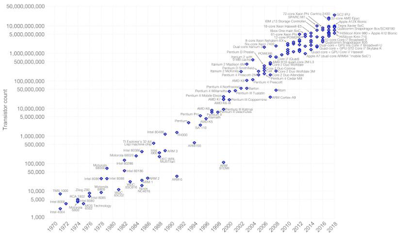
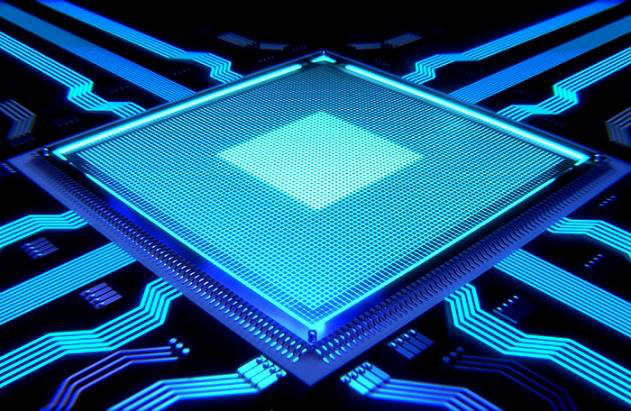
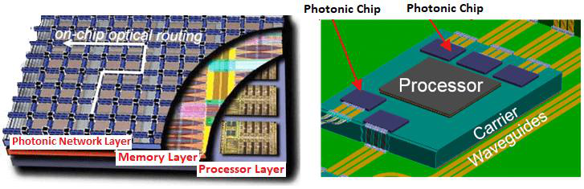
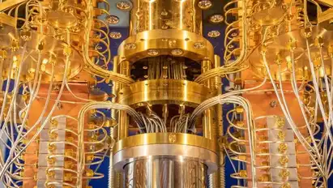

# The Future Of Processors And Computing

##### *BY  REHAN NASAR - JULY 24TH, 2022*

The CPU has had a revolutionary phase backed up with many challenges to become what it looks like today. During the initial 2000s, when the fight for performance was at its peak, AMD and Intel were contending as the frontrunners. At first, increasing clock speed posed a major threat which lasted for quite a while and didn't require much effort. However, due to the laws of physics, this rapid growth had to reach its end.

According to Moore's Law, the number of transistors on a chip had to be doubled every 24 months. Processors had to become smaller to accommodate more transistors, which would mean better performance. However, the resultant increase in temperature would depend on massive cooling. Therefore, the race for speed soon changed its trajectory to be the fight against the laws of physics. Though, the solution to this problem didn't take much of a cost. Instead of increasing clock speeds, producers now introduce multiple-core chips, where each core had the exact same clock speed because of which computers could now be more effective in performing multiple tasks during the same intervals.

The strategy ultimately prevailed but it came along with some drawbacks. The introduction of multiple cores needed developers to introduce different algorithms so that the improvements could be observable. Now, this didn't come quite easy in the gaming world where the CPU's performance had always been a prime characteristic. Another issue was that the more cores you have, operating them becomes harder.

It was also difficult to come up with an efficient code that would function with all the cores. If there was a possibility to develop a 150 GHz single- core unit, it would've been the ideal machine. However, silicon chips cannot be clocked up that fast due to the laws of physics. And this started to raise possibilities of replacing silicon in the processor industry.

Theoretically, the smallest size that is achievable is the width of a silicon atom (0.2 nm) and right now we are achieving around a 3 nm design. Inevitably, the progression of making chips smaller will come to an end. Hence, chip makers are constantly on the run trying to find out how to dodge this ultimate limitation with different kinds of gate setups, which also leads to alternative options which may replace silicon.

Optical Computing is often looked at as potential reliability in the future. Now to make these computers function on light, we need optical transistors. But there's a major obstacle when it comes to light, i.e., light has a relatively large wavelength nowhere even close to the nanometer threshold attained by silicon. Then there are these weird particles known as surface plasmon that can be excited on the surface of materials. So, they can travel like a photon, and hence they are faster than a typical silicon computer. But more importantly, it's more coherent than a silicon complement.

Ultimate light computers can be up to 5,000 times faster than conventional computers, and for processors that would mean that it's running into the terahertz clock rate which is simply mind-boggling. Even though there are some companies out there that are using light technology, we are still quite a way away from making a plasmon light computer.

There has been a lot of talk about the potential of quantum computers. As the ability to represent a superposition quantum state is immense, they can work millions of computations at once. Another reason why they're so fast is that each qubit (quantum bit), which is added to the machine exponentially grows the calculative ability of the computer. But they do face a few challenges. For instance, they need to be cryogenically cooled to a level near absolute zero which is of extreme cold. Anything around that, and you lose the property of the qubit. Another dispute is that quantum computers solve problems and that is, there are no big data machines they can only deal with specific problems. Hence, they cannot become a replacement for conventional computing.

So, they may be good at predicting the stock market or even cracking code because of their ability to simultaneously calculate these things. But when it comes to booting Windows or even playing a simple videogame, they're not that practical and a classical algorithm will probably win in a sheer speed linear calculation. So ultimately quantum computers will have a place in certain applications, but they will not replace your conventional desktop computer anytime soon.

Silicon will eventually slow down in progression, and there could be a huge investment in these types of alternative materials. Ultimately, we would not see any short-term replacement for silicon, as the infrastructure for product distribution, and sale of silicon chips have already been set up, running for decades. Replacing all that stuff would require years, not to mention billions of dollars in investment. Nevertheless, it's only a matter of time before we will see the stop of progressio in silicon technology. It's not a matter of if, it's just when.

##### *WRITTEN BY  REHAN NASAR - JULY 24TH, 2022*