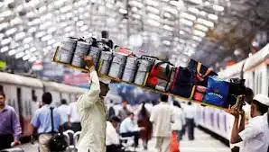

# Mumbai Dabbawalas

##### *BY  SUHAS REDDY AND RAJ RAUSHAN SINGH - MARCH 30TH, 2022*

##### **125 years old system that feeds Mumbai**

This famous case of operations and supply chain management is used by many B- schools in India and abroad including Harvard. Recognized with Six Sigma level of accuracy, their model has earned them admirers from Britain’s Prince Charles to entrepreneur Richard Branson.

Nearly 5,000 men mainly depend on suburban trains to deliver home-cooked food in more than two lakh dabbas every day. The services which started 125 years ago, is now a ₹40-45-crore industry with an average monthly fee of ₹450 per box. Their whole process is linked closely to Mumbai’s railway system.

Might sound surprising but a good reason for their success is very less reliance on technology and utmost dependence on human capital.

**Business aspect:**

A 2010 study by the Harvard Business School graded it “Six Sigma”, which means the dabbawalas make fewer than 3.4 mistakes per million transactions. With deliveries to and from roughly 200,000 customers each day that translates to little more than 400 delayed or missing dabbas in a year.

Dabbawalas claim a six-sigma accuracy level, which means only one mistake is made every 16 million deliveries. Mumbai dabbawalas are already being used as a case study, given their near-perfect managerial operations.

**Trivia:**
- Relying on their efficient and full-proof logistic system, Flipkart recently decided to partner with the Mumbai Dabbawalas to navigate the city streets.
- They have had loyal (or should that be royal) admirers in the likes of Prince Charles (as per the folklore: of the four people from India invited to his wedding, two were dabbawalas ).
- They have had a documentary made on their work by the Carnegie Mellon Professor Paul Goodman besides of course the famous HBR article.

**Scope of Management:**

Very less dependence on technology, which may lead to their downfall in the future generations.

##### *WRITTEN BY  SUHAS REDDY AND RAJ RAUSHAN SINGH - MARCH 30TH, 2022*