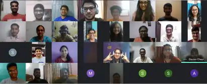
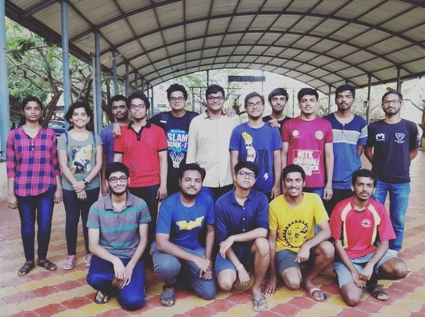
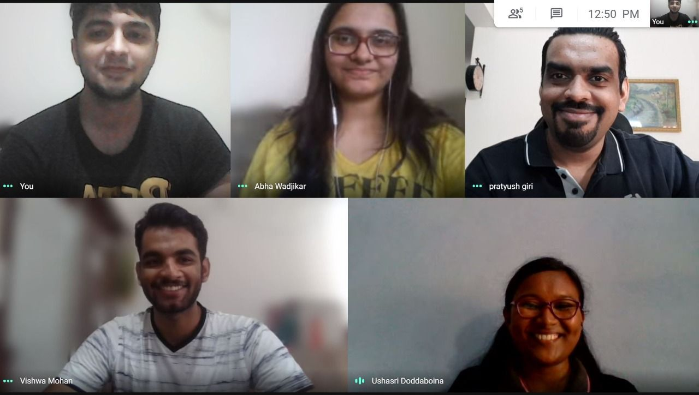
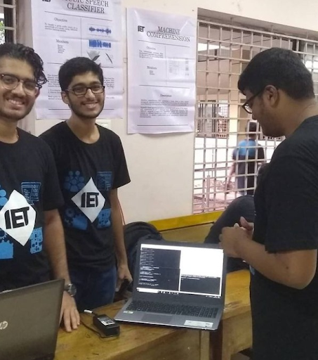
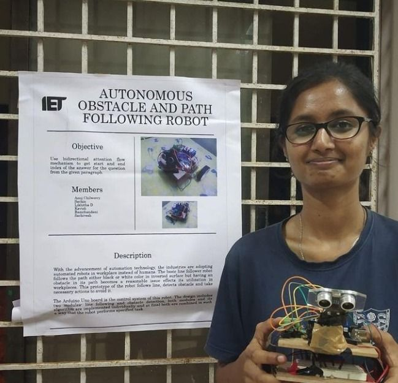
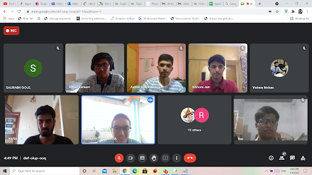
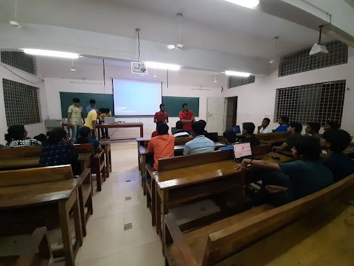
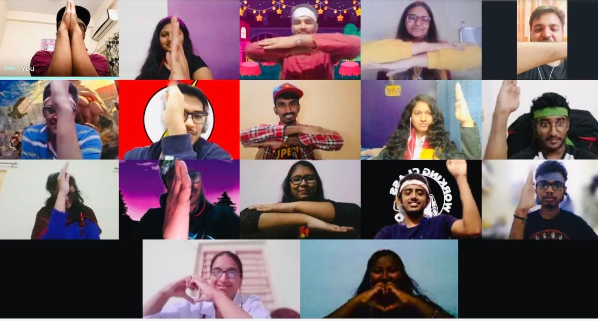
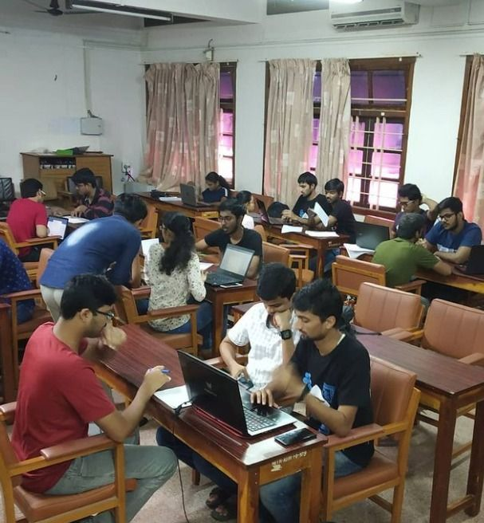

 

# What We Do
##### *BY  VISHWA MOHAN TIWARI AND LAKSH SADHWANI - OCTOBER 7TH, 2022*

IET NITK is an exclusive technical club under the IET Bangalore Division. We are one of the five other SIGs that form the exclusive club group in IET NITK.

We'll be using this article to explain how IET NITK works and what are the parts of our club: we'd explain our each of our SIGs work. Also make sure that you read on till they end: we have some tips and suggestions for you on how to deal with the recruitment season as well.

*Our seniors from Batch of 2020 and 2021*

*This is a shot from our interview with Pratyush Giri, SCP 2018*

## *Cipher*

*That's our 2019 convenor Bhargav and 2020 convenor Skanda showcasing their Cipher project.*

We are the Computer Science SIG of IET NITK. Here is where you can pursue your interest in anything and everything that has a computer (and some coffee?) involved in it: from competitive programming to machine learning and from blockchain to web and mobile development.

We also have a strong presence on our IET NITK Discord channel, where we encourage people with different tastes in computer science to hang out and share resources on what they like or what they wish to learn.

Some of our highlight projects are: Virtual TryOn (trying on fashion virtually via AR), Experiencing Homes in VR (Checking out homes and apartments virtually) & Face to Emoji (an ML model to convert a portrait to an emoji). None of these projects were conceived overnight: we consider and evaluate our projects each year after thorough discussions and requirements analysis.

We love to conduct events as well: we find that there is a huge trove of topics in Computer Science that we can geek about, so we encourage all our members to hold KEPs to enlighten the audience. Despite the online semester, we've held some of our highlight events like Brute Force Made Easy (our annual CP contest), CommitCon (Git and Open Source Festival) and Innerve (IET NITK's annual showcase). And this year, we have an even bigger agenda on the events side: to bring in professionals and alumni to enlighten us about their particular fields.

Don't be under the impression that all we do is host public events and do projects! We also hold weekly CP preparation contests for our members before summer vacations for internship and placement season as well. And we're definitely not "all work and no play" either: we regularly hold SIG-wide game contests to engage all the members too.

## Recruitment Process

The first step, as always, is to fill the main IET NITK recruitment form from here. With that done, following is the process:
- An online test to evaluate your knowledge on C programming ,Basic C concepts and Aptitude.
- A Technical interview for us to know more about you: how you are, and how you would approach a problem in the CS/IT field.
- An HR interview to know what you’re looking for and what you can offer to IET NITK and Cipher in general.

## *Rovisp*

*Likitha at Project Expo*

Rovisp SIG is a group of IET people interested in electronics, communication, ML and signal processing. Here is a place to pursue your interest in software + hardware (embedded). From implementing and demonstrating electronics-based hobby projects, conducting Events , Competitions, Knowledge Exchange programs to having mentorship programs for juniors etc. we also have extra co-curricular activities like blog writing, speaker series and sessions from alumni.

Some of our highlight on projects successfully completed by our SIG are Automatic Medicine Pill Dispenser, Smart Car Parking System, Mini Jarwis using Arduino, Programmable DC load, and more (check out our section on our website).

*Speaker series by our alumni Vibhore Jain (Analog Engineer at TI) and Rohan Katkam (MS at TU Delft)*

Also here are events conducted by our SIG: Speaker Series from alumnus, PCB Design Workshop, Arduino Workshop, SMP on Digital Design, Home Automation and arduino. Some of our within-club activities are Ethical Hacking KEPs and blog writing.

## Recruitment Process

The first step, as always, is to fill the main IET NITK recruitment form from here. With that done, following is the process:
- A preliminary test to evaluate your knowledge on Basic Electronics(circuit Theory), Digital Electronics(Till combinational circuits), Basics of BJT, Op-amp, Aptitude and puzzles
- A Technical interview for us to know more about you: how you are, and how you tackle problems in Electronics Engineering, ML, Signal processing in general.
- An HR interview to know what you’re looking for and what you can offer to IET NITK and Rovisp in general.

## *Torsion*

Torsion is a collaborative space for enthusiasts in the field of Mechanical, Chemical, Civil, Metallurgical and other core departments, to discuss and debate, innovate, build up ideas, and work on a variety of projects. Right from analyzing the problem statements in real life situations to emphasizing the applications of the outcomes we bring out via the above solutions, Torsion has always provided the right guidance path to all its peers.

Some of our predominant projects in the recent times are CFD Analysis of Dimpled Wings, Stent for constricted Blood Flow, Quadcopter, Rubik’s Solver Bot and various other projects using Ansys and Matlab concepts. These multi concept projects didn't happen overnight. They were taken right from the scratch with group discussions, weekly meetings and requirements such as study materials, tutorials were provided along with one on one interaction sessions at all times.

Keeping the projects on one hand, Torsion has never failed to enlighten its other aspiring junior core engineers with various mind blowing concepts in their field via various events. Despite the online semester we could successfully pull off events like Torsion sculpt, Talk on research internships and MS Abroad, Webinars on different softwares like blender, CFD, MATLAB, AutoCAD bringing in our alumni from various parts of the world. We give a clear picture on what you guys can do at the present to mold your future in your field of interest.

After all this if you are still figuring out your interests, no worries because Torsion got it's series of KEPs on some really important softwares from both engineering and career point of view. We cover all the way from basic AutoCAD to complex concepts on Catia including Matlab, Ansys, SolidWorks and Blender.

Isn't this a three year full fledged package on how you can lay down a strong foundation to make the best for your career. To avail this do register for Torsion IET NITK and be a part of our family.

## Recruitment Process

First thing you should do is to fill the main IET NITK recruitment form from here. With that done, following is the process:
- An online aptitude test to evaluate your knowledge.
- A Technical interview to assess your knowledge about Mechanical, Civil or Chemical Engineering in general. Don't worry, we wont be testing you like professors, but we’ll also use this time to understand how you come up with ideas. We’re interested in seeing your attitude to problem solving in general.
- An HR interview to know what you’re looking for and what you can offer to IET NITK and Torsion in general.

## *Medium*

In Medium SIG we do video editing, graphic design and publicity for our club. It is a non-technical SIG in IET NITK. Responsibility of the Medium SIG is to increase outreach of our social media handles such as Instagram, LinkedIn, Facebook. We create a platform where club members can express their creativity while focusing on other goals. We increase the brand awareness of our club, and keep it going. We create a good image of the club within the student community so that the best people join us. If you love creativity then this is the place you need to be at. We have conducted various KEPs such as the ones on Wondershare Filmora, Adobe Photoshop, OBS. For the summer mentorship program , IET Medium has offered an SMP on Photoshop and Graphic Design called Photoshop, Edits and GD for which there was an immense response.

## Recruitment Process

The first step, as always, is to fill the main IET NITK recruitment form from here. With that done, following is the process:
- A take-home assignment that you would be asked to complete in given time. Details about the assignment would be given to applicants before-hand.
- A Technical interview for us to know more about you: how you are … Basically we want to understand more about you here.
- An HR interview to know what you’re looking for and what you can offer to IET NITK and Medium in general.

## *Inkheart*

INKHEART is a non-technical SIG of IET NITK where you can explore and pursue your creative interests in literature, philosophy and creativity through a variety of activities like book reading, debating, weekly talk sessions, etc. It is a place for one’s overall skill development and we aim to keep the developing curve rising with our extensive range of exciting events along with providing an opportunity to lead amazing teams and leave your trail!

One of the prominent events of INKHEART is the ESCAPE ROOM series where distinguished speakers from different walks of life come and share their experiences. Another exciting segment is the INKHEART RECOMMENDS where we give audio reviews on a wide range of movies, series and books of different genres. Community, Ugly, Bandersnatch and The Sky Is Pink are some of the popular shows and movies we have reviewed so far and more are yet to come on the list. A session on “The art of cinematic soundscapes” to take you through the process of music production skills and make some tunes, because if it sounds good, it is good Book reviews and Freshers Debate were other spectacular events. Last summer was a happening one with three interesting Summer Mentorship Programmes from Inkheart which included Maestro of Rhetorics, French for Beginners and Lights Camera Script.

We love to have fun while learning, so not only do we organize events for the development of the student community, but also have some exciting rounds of games, team bonding sessions, biweekly debate sessions and more fun-filled activities to refresh ourselves from the boredom of academics.

## Recruitment Process

The first step, as always, is to fill the main IET NITK recruitment form from here. With that done, following is the process:
- A take-home assignment that you would be asked to complete in given time. Details about the assignment would be given to applicants before-hand.
- A group discussion to see how you engage with others and gauge how well you can come up with cool ideas.
- An interview for us to know more about you: how you are … Basically we want to understand more about you here.
- An HR interview to know what you’re looking for and what you can offer to IET NITK and Inkheart in general.

## *Venture*

Venture SIG is a platform to learn and build up and explore the domains in the field of commerce, economics, management and much more.

Even though being the latest member of the IET NITK family, we have planned upon our upcoming project ideas. Some of them are Stock Trading Bot, Blockchain based peer to peer mobile payment platform, Merger and Acquisition case study, Mock Start-up case study and much more.

One of the trademark events that we conducted was TRADEVERSE. Tradeverse provided a platform to gain first hand experience on the Stock market as well as training. The KEP we provided gave everyone a strong basis about the same and the next two days of virtual trading provided everyone the best place to learn and acquire new skills as well as interact with many people during these hard times. And, the whole event had an added bonus of cash prizes for its winners. We have also started a mini video series where we provide information as well as the basis of different fields related to business, management and economics. Our first short clip on Entrepreneurship provided solid understanding about the same.

We conduct interesting and exciting events not only for everyone but specifically for members as well. The IPL auction event conducted for club members proved to be successful as well as engaging. Different team involved in a fun and intense auction was just the perfect thing we needed to cool out our mind but also gave us insight into various aspects of auctioning as well.

## Recruitment Process

The first step, as always, is to fill the main IET NITK recruitment form from here. With that done, following is the process:
- A Technical + Aptitude test to evaluate your knowledge.
- A Technical interview for us to know more about you: how you approach problems in the fields of our interest and what are your views to some of the current problems faced in finance/economics.
- An HR interview to know what you’re looking for and what you can offer to IET NITK and Venture in general.

## *Tips for Recruitment Season*

*That's how a recruitment interview would've been if college wasn't virtual ... This is from one of the rooms in Main Building.*

We have some tips for you on how to handle the season:
- Most importantly, keep calm throughout.
- Keep an open mind during the interviews: speak what you’re thinking.
- Be honest with your expectations: both what you can deliver as well as what the club can give you.
- Ask questions: the test would prove your technical capabilities, but club interviews are mostly about how

##### *WRITTEN BY  VISHWA MOHAN TIWARI AND LAKSH SADHWANI - OCTOBER 7TH, 2022*