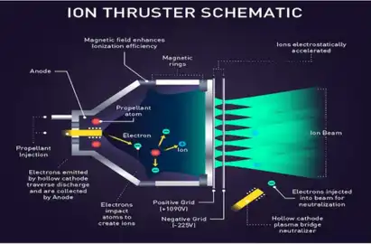
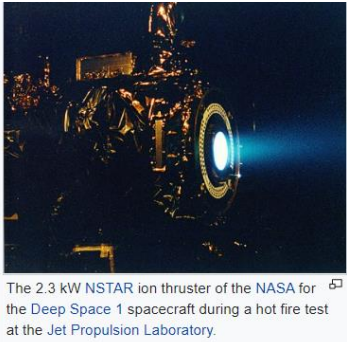

# Ion Thrusters
##### *BY  VADLA AKSHITHA - OCTOBER 9TH, 2022*

An ion thruster which is also called as ion drive or ion engine is a kind of electric propulsion which is generally used for spacecraft propulsion. The main function of this ion thruster is that it creates thrust by accelerating ions with the help of electricity. An ion thruster uses propellant. A propellant is a gas like Xenon. These thrusters ionize a neutral gas or inert gas by extracting some electrons out of atoms, to create more number of positive ions. Ion thrusters depend on electrostatics or electromagnetics as these ions get accelerated by Coulomb force along electric field or by Lorentz force.

The working principle of these ion thrusters is by using electrically charged atoms or molecules to create thrust in accordance with momentum conservation. Ion thrusters are categorized either as electrostatic or electromagnetic. The main difference is the method for which the ions accelerate. ❖ Electrostatic ion thrusters use the Coulomb force and accelerate the ions in the direction of the electric field. ❖ Electromagnetic ion thrusters use the Lorentz force to move the ions.

### **Current use of Ion thrusters**

Ion thrusters (based on a NASA design) are now being used to keep over 100 geosynchronous Earth orbit communication satellites in their desired locations, and three NSTAR ion thrusters that utilize Glenn-developed technology are enabling the Dawn spacecraft (launched in 2007) to travel deep into our solar system. Dawn is the first spacecraft to orbit two objects in the asteroid belt between Mars and Jupiter: the protoplanets Vesta and Ceres.

### **Current use of Ion thrusters**

The main advantage is that they can achieve extremely high Specific Thrusts (ISPs) compared to other rocket engines such as booster rockets. Therefore, ion thrusters can achieve high specific impulses. The main drawback is low acceleration. Because the mass of electric power unit is directly proportional to amount of power.

### **Conclusion**

Ion thrusters have proven to be a viable and powerful alternative to conventional debugging systems. with very low fuel demand due to the very high specific current generation ion thrusters can easily compete with chemical systems even if the output power is very low.

##### *WRITTEN BY VADLA AKSHITHA - OCTOBER 9TH, 2022*