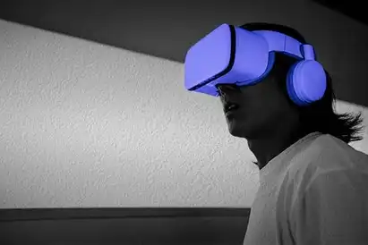
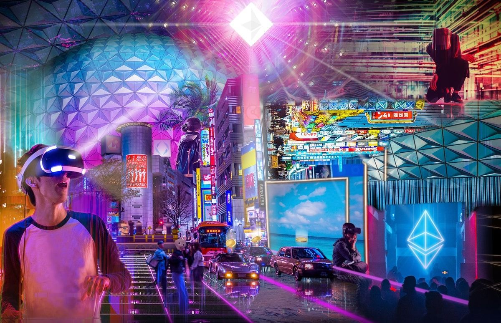

# Entry To The Metaverse: A Virtual World

##### *BY  VIGHNESH KOTHALIKAR AND VAISHNAVI PRAKASH KALGUTKAR - MARCH 13TH, 2022*

Technology is ever-changing and, because of that, so is marketing. The evolution of the metaverse is just one recent development in the world of technology, but one that will have a huge impact on the human experience as we know it. In this post, we will introduce the metaverse. This will include a breakdown of what it means and a look at both its current and future states.

## What is The Metaverse?

Metaverse is a virtual world based on blockchain technology. This all-encompassing space allows users to work and play in a virtual reflection of real-life and fantasy scenarios, an online reality, ranging from sci-fi and dragons to more practical and familiar settings like shopping centers, offices, and even homes. Users can access metaverses via computer, handheld device, or complete immersion with a VR headset. Those entering the metaverse get to experience living in a digital realm, where they will be able to work, play, shop, exercise and socialize.

## Metaverse and NFT: How Are They Related?

An NFT, or non-fungible token, is anything digital that cannot be replaced as it doesn’t have a tangible value. The most common forms of NFT today are digital art like animations. However, within the metaverse, an NFT can become so much more. NFTs are revolutionizing the gaming business by allowing players to own and benefit from the stuff they acquire or build in the game, as well as carry those profits or assets into real life. Previously, if you played a game like Axie Infinity (AXS), the awards you earned were exclusively redeemable in that game. Axie players can now win cryptocurrency incentives that have real-world worth.

## Metaverse Events

In this post-COVID world, it’s easy to imagine the continued need for virtual meeting spaces. From family get-togethers to concerts to non-profit galas, the metaverse has no limits on who you can meet up with and when. A metaverse startup company recently sold 620 virtual sneakers for $3.1 million in less than 5 minutes. A Snoop Dogg fan paid $450,000 to be his next-door neighbor in the virtual world. Justin Bieber organized a concert in the metaverse and fans went meta-crazy. While metaverse is still in development, these new worlds offer exciting social and financial possibilities in the future. Metaverse can provide users with new opportunities to play, invest and socialize. While progress on the different unique metaverse platforms is notable, it is the ability for the numerous metaverse games to interact and interoperate with one another that has the potential to turn the nascent blockchain gaming ecosystem into a worldwide economic pillar.

##### *WRITTEN BY  VIGHNESH KOTHALIKAR AND VAISHNAVI PRAKASH KALGUTKAR - MARCH 13TH, 2022*