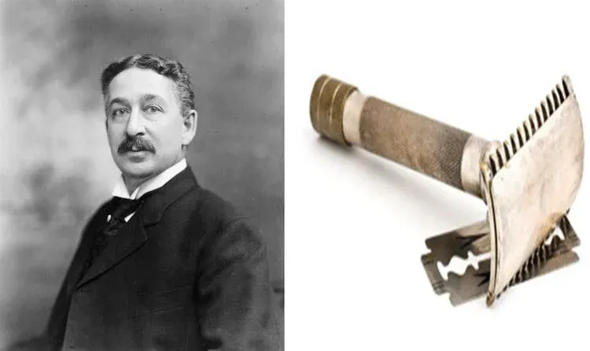

# Razor And Blade Business Model
##### *BY  NITHIN L N AND ADITYA SANJIV JOSHI - JULY 19TH, 2022*

*"Give them the razors and make them come back for blades".*

This was the marketing strategy adopted by King Gillette in the 1900s when he invented the disposable safety razor. This revolutionized the shaving industry. The razors were sold at a low price, making them popular, but only the blades produced by him would fit them. He made a fortune by selling patented razor blades.

Today, the net worth of Gillette is approximately 7.55 billion U.S. dollars!! The razor blade business model involves selling a product at a lower price, then selling a related product later for a profit.

Gillette is one of those few companies that has been in the market for more than 100 years surviving seven revolutions and two world wars! In the late 19th century, there were only two kinds of razor blades used, viz., Straight razor and safety razor. The Straight razors were considered too risky because they were super sharp. The safety razor was like a one-time purchase, but once you bought it you had to frequently keep sharpening it.

To reduce the prices and to make shaving affordable for everyone, a traveling salesman named King Camp Gillette came up with the idea of detachable disposable blades with a single razor. This became a huge hit in the early 1900s, and Gillette became the market leader for about 15 years, but the sales were down by 20% in just one year once the patent ended in 1921.

This is when the revolutionary idea of the razor blade model came into existence. Gillette sold the razors at an ultra-low price and sometimes even at a loss while capping the price of blades at a higher margin. Once the customer buys razors from Gillette, the customer has entered the "Gillette's Ecosystem" and there is no going back. So the customer keeps buying the blades we can have a recurring profit from each customer. After 1922 when the razor blade strategy was fully implemented, the sales of Gillette razors skyrocketed by a humongous 127%.

The product(razor) is appealing as it is sold at a low price. It then implicitly forces the customers to buy related products (blades) ensuring study revenue. It also creates customer loyalty as the customer gets used to the current product and may think twice to switch to a different company and there are also potential high psychological switching costs. By developing and providing various kinds of related products(blades) the company gives customers freedom and flexibility to choose from a wide variety of products.

Aside from razor blades themselves, there are many other brands in different industries utilizing this business model. Gaming industries extensively use razor and blade business model. Sony uses its pricing model and sells its PlayStation consoles at a loss, just so that they can make recurring profits through CDs and PlayStation Plus subscriptions. Microsoft makes no money on the sale of its Xbox One X game console

even at an average $499 price, but it gets about $7 out of each $60 video game. Keurig sells a range of single-serve coffee makers, with some available for less than $100, where it makes money in the sale of coffee pods, with a 6-pack alone retailing for around $20. Amazon Kindle today is being sold at almost 0 profit just so that Amazon can make billions out of its e-book sales.

Like every strategy, even this 'almost best' strategy has its own drawbacks. The biggest threat to the razor and blades business model is competition. Other companies may attempt to maintain their consumable monopoly (and maintain their margin) by preventing competitors from selling products that match with their durable goods. For example, computer printer manufacturers will make it difficult to use third-party ink cartridges, and razor manufacturers will prevent cheaper generic blade refills from mating with their razors. If a competitor offers a comparable consumable product at a lower price, the sales of the original company's product suffer, and their margin erodes. Brands that implement the razor-blade model always run the risk that they will not recoup their initial costs. If the business is heavily subsidizing the initial product, poor sales in the premium product may result in an overall loss.

Businesses need to understand that this model is a double edge sword because if they are too dependent on this strategy, they might end up like Kodak. They were so stuck in making money by selling their film rolls that despite being one of the first companies to file a patent for digital cameras, they did not realize that the film roll itself will cease to exist with the rise of the digital revolution. From being the leader of cameras to disappearing from the market itself just because of depending too much on this model.

Nevertheless, this model yields maximum user retention. If this method is implemented correctly with a well-planned pricing strategy taking into account all other confounders and factors, ensuring flexibility and customer loyalty, it can do wonders. This is a proven fact, and this is how the Razor Blade strategy is being used by the top industries like Apple, Sony, Amazon, One-Plus, etc. and has become the billion-dollar strategy.

##### *WRITTEN BY  NITHIN L N AND ADITYA SANJIV JOSHI - JULY 19TH, 2022*