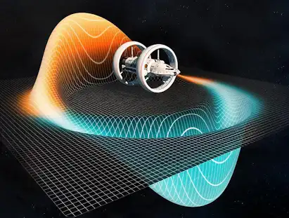

# Warp Drive: Key To Faster Than Light Travel

##### *BY  AMRITH RAJ - AUGUST 2ND, 2022*

Humans have always been curious beings. We have an inherent drive to explore. We started from venturing out of our caves and made it to the point where we are venturing into the inky depths of space. But space travel is not an easy task. Lifting things off the ground and putting them into orbit or moving them across vast emptiness of space requires a lot of energy, resources, and time. The ordinary chemical powered rockets which we use today are developed in the mid 20th century. The basic concept of how rocket engines and motors work did not change from then till date. But the human mind always yearns for more and does not stop.

A warp drive is a fictional propulsion system in many science fiction works and is a subject of ongoing physics research. The general concept of warp drive was introduced by a 1957 novel, Islands of space written by John W. Campbell and popularized by the series Star trek.Einstein, in his paper published in 1905 on Special theory of relativity, theorized that an object passing through space will bend space due to its mass and inflates time as it goes faster. The ratio of these two has a maximum limit which is the speed of light and is constant. Anything that has mass requires an infinite amount of energy to reach this limit, much less to overcome it.

In 1994, Miguel Alcubierre while doing his PhD study at Cardiff university in Wales, proposed a method for changing the geometry of spacetime by creating a wave that would cause the space ahead of a spacecraft to contract and the space behind it to expand. The ship would then ride this wave inside a region of space, known as a warp bubble, and would not move within this bubble but instead be carried along as the bubble itself moves due to the actions of the curved space-time that pulls and pushes the spacecraft from both ends. Since the ship is not moving through space-time but moving space-time itself, relativistic effects like time dilation would not apply, allowing faster-than-light travel.

Although it is a theoretically sound concept, it is still far away from implementation in labs for testing it and to practically work out because of two reasons primarily.
- The amount of positive and negative energy needed to create a warp bubble still is the biggest challenge associated with this concept. Currently, scientists believe that the only way to support the negative energy density needed to produce the warp bubble is through exotic matter. While the mechanics of an Alcubierre drive works with Einstein’s General Theory of Relativity, the creation of negative energy densities is an unknown technology due to a lack of understanding on dark energy and exotic matter and therefore may be impossible. Scientists also estimate that the total energy requirement would be equivalent to the mass of Jupiter.
- Space is not just empty between any two given points. It is full of cosmic particles of varying properties. Researchers from the University of Sydney have done some calculations on the effects of faster than light space travel taking into consideration all the particles an Alcubierre drive spacecraft might face while travelling. They found that the particles can get swept up into the warp bubble and focused into regions around the ship, as well as within the warp bubble itself. When the spacecraft reaches its destination, the particles its bubble has gathered are released in energetic outbursts that can destroy anyone standing directly in front of it.

But some researchers are hopeful that these difficulties that they face in creating this technology are possible to overcome. The energy estimates being equivalent to the mass of Jupiter for achieving faster than light travel is already much better compared to the older estimate of energy requirement of infinity. As time goes on, many more discoveries and ideas will improve our understanding of our universe and have better tools. If historical cases are any sign, eventually the technology needed to build an Alcubierre drive may pass a point of no return and suddenly seem entirely possible and we can travel to distant galaxies much faster than light itself. As Captain James T. Kirk said in Star Trek, to explore space, the final frontier, is to boldly go where no man has gone before.

References:
1. [https://www.sciencealert.com/scientists-are-starting-to-take-warp-drives-seriously-especially-this-one-concept](https://www.sciencealert.com/scientists-are-starting-to-take-warp-drives-seriously-especially-this-one-concept)
2. [http://www.universetoday.com/93882/warp-drives-may-come-with-a-killer-downside/#ixzz2FaZsXDuM](http://www.universetoday.com/93882/warp-drives-may-come-with-a-killer-downside/#ixzz2FaZsXDuM)
3. [http://www.npl.washington.edu/av/altvw81.html](http://www.npl.washington.edu/av/altvw81.html)

##### *WRITTEN BY  AMRITH RAJ - AUGUST 2ND, 2022*