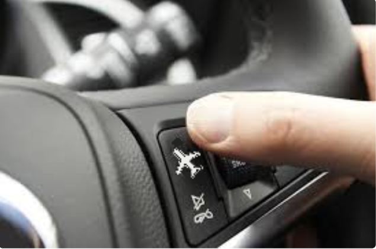
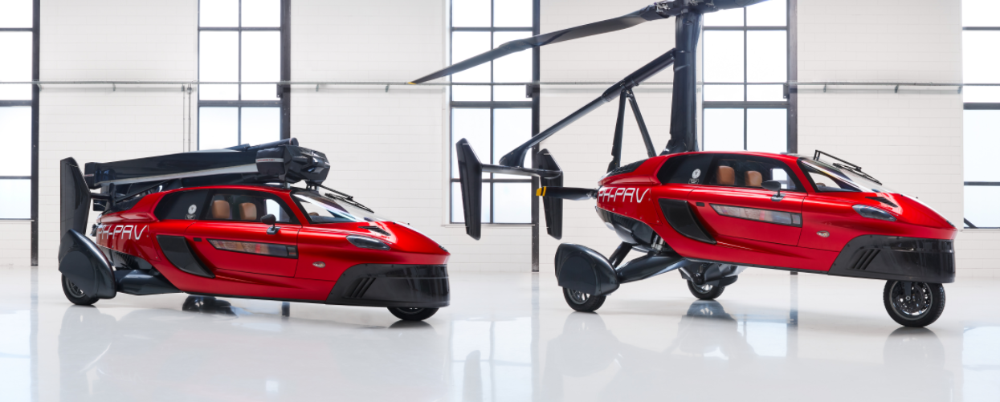
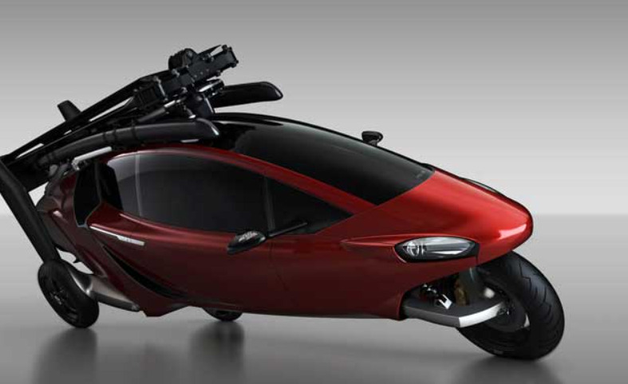
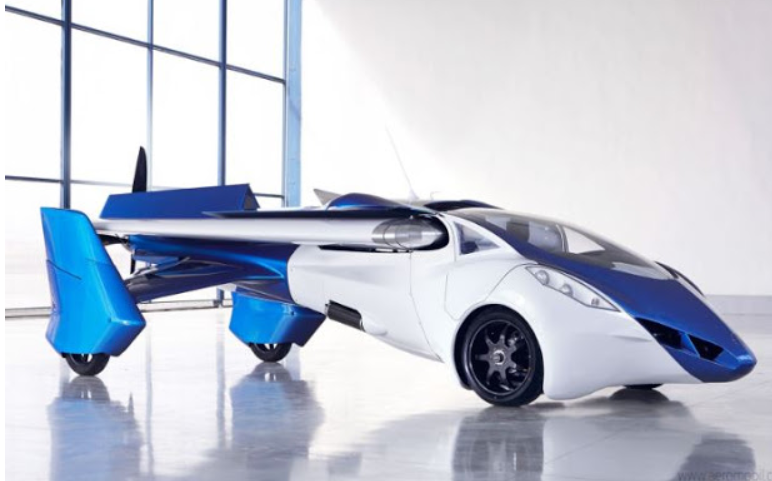
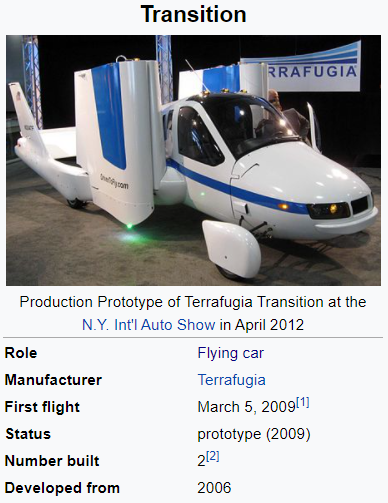

---
title: All About Flying Cars
authors: ['M Poojitha']
image: jetsons.jpeg
displayOnBlog: false
date: "2021-03-09"
---

Have you ever been stuck in heavy traffic or unlucky enough to encounter every Red signal in the junctions you pass through and wished to have a "skip ad" button like the one on YouTube by taking off  car, to fly like a bird over the road in the sky as shown in sci-fi movies

Don’t think you are crazy to be fascinated about the things that exist only in a supernatural world and sci-fi movies!! 

**A CAR THAT FLIES, A PLANE THAT DRIVES**

They are happening !!!. I’m certain flying cars will exist in the future !!

A flying car was once thought to be possible in the movies, however, the world is closer than ever to experiencing this mind-blogging phenomenon.

Scientists and Engineers we have today are no less than wizards and superheroes in the supernatural world. They can make nearly anything possible.

There are hurdles obviously but a lot of research and development  is going on to make “Flying cars” possible in the near future 

It has been a life-long dream of young and old dreamers, since at least the 1950s. **Drive your vehicle out of the garage at home, go to the nearest airport, unfold its wings, and FLY!** 

***Intriguing right?***

***let's dive into the world of flying cars:***

Flying cars are far smaller than a plane, most are designed with rotors like drones instead of wings, which allow vertical takeoff and landing. Tilt rotors allow great efficiency in forward flight at longer distances, while multi-rotors are designed to reduce noise in hover flight.

Dreams about flying cars started long ago in the early 19’s. lets see the early developments of flying cars

***History:***

1917- Glenn Curtiss build the first known prototype of a flying car 

In 1936: Henry Ford developed **“sky flivver”.**The project was abandoned due to a pilot death because of a flight crash

In 1940: Henry Ford predicted: "Mark my word: a combination airplane and motorcar is coming. You may smile, but it will come.”

In 1946:The **Fulton FA-2 Airphibian,** American-made [roadable aircraft](https://en.wikipedia.org/wiki/Roadable_aircraft "Roadable aircraft").           Four prototypes were built although it was not a commercial success 

In 1947, Henry Dreyfuss developed the ConvAirCar, which was an automobile with wings and a propeller on the roof. The vehicle was made of fiberglass. However, it crashed during a test flight, resulting in a fatal accident.

In 1949: The **[Aerocar**](https://en.wikipedia.org/wiki/Aerocar "Aerocar")**, designed and built by [Molt Taylor](https://en.wikipedia.org/wiki/Molt_Taylor "Molt Taylor"), made a successful flight.  In total, six Aerocars were built.  despite wide publicity and an improved version produced in 1989, Taylor did not succeed in getting the flying car into production.

In the early 50s, Leland Bryan flew his Autoplane but ended up dying while crashing another version of it two decades later.

1973: Another tragic flying car death occurred in 1973 when Henry Smolinski crashed in a test flight. His creation paired a Ford Pinto with a Cessna Skymaster 

, And few others 

By the 21st century, many companies are involved in developing electric flying cars. Some of them are uber,cartivitor, kitty hawk corporation,           E-Volo, Airbus, EHang, etc.

Few successful developments are:1)PAL-V Liberty

`                                                                          `2)Aeromobil

`                                                                          `3)Terrafugia Transition

`                                                       `4) Terrafugia-TF-X etc…

***PAL-V Liberty :***

- The Personal Air and Land Vehicle(PAL-V) is an aircraft manufacturer based in  Netherlands.
- ` `The company has been in business for more than 20 years with the dream of building an actual flying car from the get-go.
- ` `After years of research and development, it launched its first flying car known as PAL-V Liberty.
- The PAL-V Liberty is the world's first production legal flying car on sale
- After being the first flying car to get road permission for Europe, PAL-V is now also the first to complete the full certification basis with EASA (European Union Aviation Safety Agency)

- **“The PAL-V flying car, having two engines, can run at a speed of 160 kilometers on road and can fly at a speed of 180 km. The car can turn into a flying vehicle in just three minutes and cover a distance of 500 km on a full tank.”**

- **This is soon going to be a reality, even in India!**
- As per a statement released by the company, the government would assist PAL-V to obtain all the necessary approvals that will be required to ***set up the manufacturing facility in Gujarat***. 

***AeroMobil:***

- Slovakia-based AeroMobil remains committed to releasing a functioning flying car it calls “a supercar with superpowers.” 

- It’s on its fourth prototype, so you know it’s not joking

- The latest version of AeroMobil has undergone over 10,000 hours of simulated and live flight tests throughout its development.

- AeroMobil claims the test flights were successful and vehicles will be available in 2023 that can fly at 160 miles per hour.

`                                 `AeroMobil 3.0

***Terrafugia Transition:***

- By April 2014, 12 two-person test flights had taken place; this was the first time that anyone other than Terrafugia's chief test pilot had flown the Transition

- In January 2021, Terrafugia announced that the Transition received a Special Light-Sport Aircraft (LSA) airworthiness certificate from the FAA for the Transition to be flown only, with road use approval to follow in 2022.
- **So that’s one step to becoming a flying car.**
\***

So what are your opinions about flying cars now?

They are cool right!!

Obviously, but what do u think about their safety? Their cost-efficiency?

so if we look deep beyond the advantages we are having, we surely have some challenges to face.

Creating a flying vehicle that’s safe for users poses numerous engineering challenges.

Few challenges are:

**Weight**: 

Aircraft MUST be light to fly. Cars need to be strong to pass mandatory crash tests. Those requirements are contradictory. Most proposals end up as an awkward hybrid.

**Cost:** 

No Doubt, too expensive. Even a flying taxi also costs much higher than a normal taxis. Maybe mass production and high usage electric flying cars and developments,poosibly soon can make us take a ride

***Safety:***

Flying cars pose serious safety issues. A car that malfunctions fifty feet up in the sky, the danger is magnified many times over.

- What if a flying car malfunction or run out of fuel or battery in the middle of a busy city and falls down on a crowd of people?

***Energy consumption:***

They consume a lot of energy so need to have a better battery or fuel  backup  to avoid fatal accidents 

Hope these challenges and issues are addressed and solved with future technological advancements and one day we can take a ride in flying cars just like we have dreamt.But it will be no longer be a fantasy or dream sure they will take quite a long time and effort  because   even the great ***“Rome wasn’t built in a day”!!***

In the meantime, most of us will be driving on the ground.

\*** 

