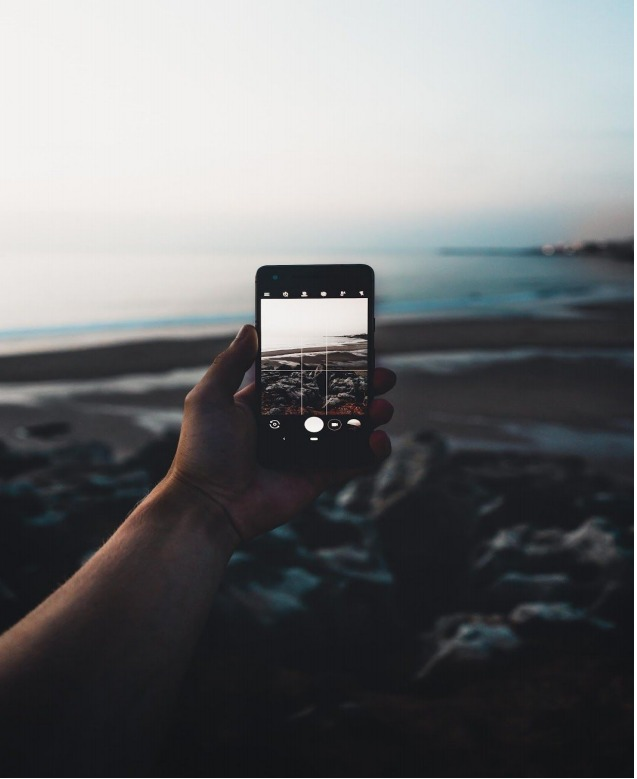
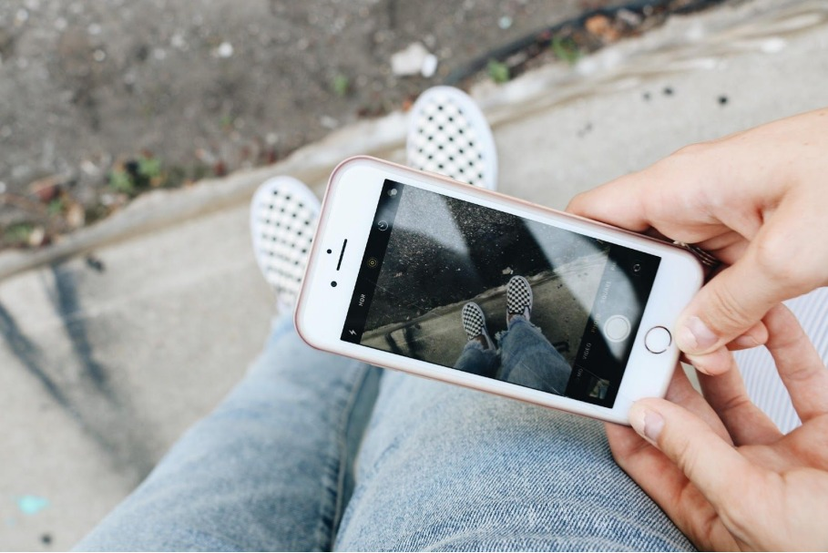

The ability to capture the memorable moments with a device is the best invention of the mankind. And not all photographs require a DSLR camera. Many people today believe that mobile camera is good enough for most photography needs. And they are not wrong. A mobile camera is sufficient for most our needs. They are quicker, easier to carry and use.

However the cameras weren't affordable and required high skills to operate until the invention of ISOCELL sensors that were easily embedded in mobiles and helped us to capture hassle free snaps in an instant.

We all have a hidden photographer inside us and to bring out the photography talent in us a mobile camera is helpful. 

At times to get a great photograph, a camera that allows to manage the ISO,aperture,shutter speed is essential right? Thanks to our Smartphones!,especially the recent updated versions of them. Many of them allow us to adjust the ISO , aperture and shutter speed to some extent and according to our requirement. 

We don’t see professional photographers use mobile cameras for all their photography shoots. But as said earlier, for most of our needs being a good mobile photographer is enough.The rise of mobile photography/smart phone photography is mainly social media based. Also, photography on social media has come an extremely long way.

When you think of someone doing photography on mobile phones, you might assume the photos to be average. However by following a few tips you can get good pictures .Here are some of them:
- Use of gridlines: It is one of the easiest and effective way to improve your mobile photos. Use of gridlines helps in balancing your shot and sometimes it can make our click from better to best one.

- Setting a focus on one subject : Today’s smartphones automatially focus on the foreground of our frame.But, sometimes every picture might not have an obvious subject. In such cases ,spending some extra time on setting focus on an intresting subject will lead to good shots.

- Avoid zooming in : At times ,it can be tempting to zoom in, especially if you are capturing the shot from a distance . But, its actually better to avoid zooming in, as it can make the photo blurry or pixelated. Instead, cropping the required part of picture after clicking it can be useful.
- Play with reflections : Every body loves seeing reflections in photos. Our eyes are always drawn towards the reflections in photos . So before clicking a picture it is always better to look for reflections that can be captured.

- Look for repetitive patterns : Sometimes having repetitive patterns in photograph can enhance its looks and make it more interesting.They are very pleasing to our eyes. At times they can be present naturally in a photograph making the shot visually attractive. Even in their absence , creating opportunities for patterns can have strong visual impact.

These were some of the tips that can bring a great effect in your shot. But, there are no specific rules to be followed. Remember! being creative and experimental are most important. Apart from the tips mentioned above few others like, looking for symmetry, avoiding the use of flash light, having proper exposure and natural light can be useful while photographing few things.

Photographing is the first step to make it visually attractive. Editing the raw shots is the next step. It is the most important and crucial step in getting great photos. Sometimes just by adding a suitable filter to our
photo, we can bring many changes and make them look great!

Some useful links :
- [35 Photography Tips that'll help you take incredible smartphone shots](https://iso.500px.com/35-mobile-photography-tips-thatll-help-you-take-incredible-smartphone-shots/)
- [Mobile Phone Photography Tips](https://www.digitalphotomentor.com/mobile-phone-photography-tips/)