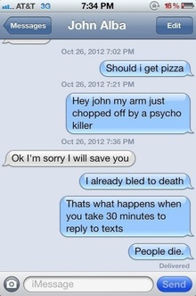
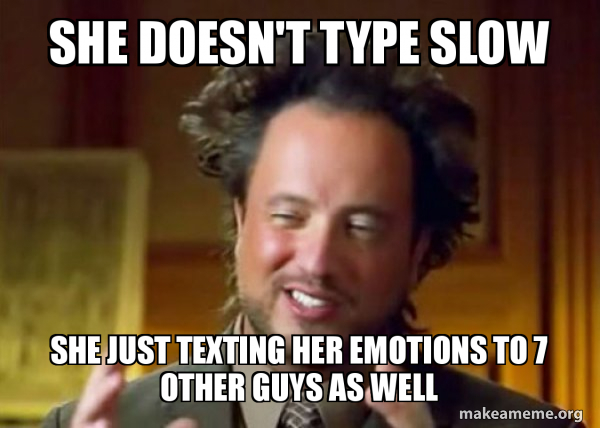
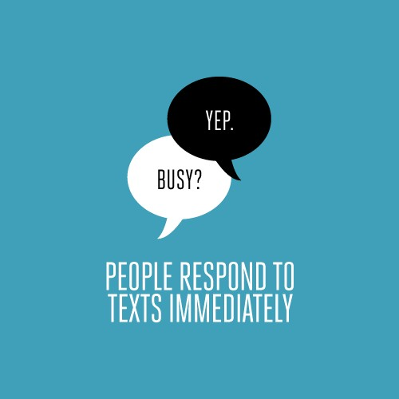
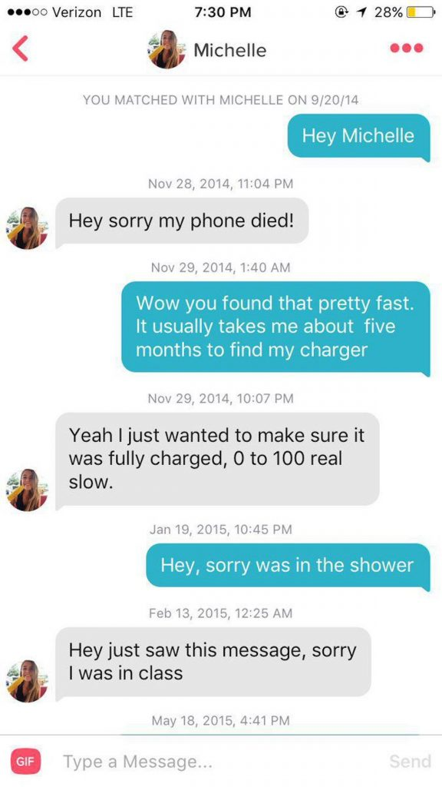
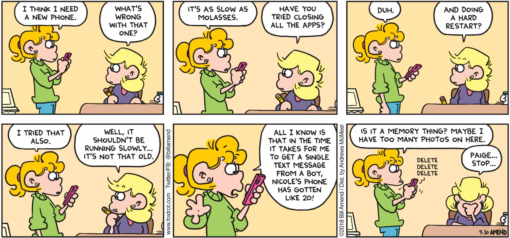

A few weeks ago, I was texting my friend, who would take hours to respond to my messages. It drove me insane. Naturally, I’d give him hell for it. During one such tantrum, he gifted me the following thought: if I haven't replied to you, he said, it means I haven't looked at my phone, And if I'm not looking at my phone, I'm in my right place.

I completely understood that. The anti-screen time revolution was in full swing. We were all trying to reclaim ourselves from our phones, myself included. That thought's been coming back to me often. Maybe because I have 60+ WhatsApps marked unread to respond to later and 50 somethings emails from people like that I haven't felt like sitting down with for weeks.

` `Invariably when I do respond to such dispatches in wait, I begin with some sort of forgiveness seeking-"sorry I didn't reply sooner (I'm not)/ "sorry I didn’t see this of (course I did)/"sorry I haven't had a chance to reply!" (Chances were plentiful).  

Another friend sending a check-in text ended it with: "Pingback in your own time. I quite like ssss-looooo-www messaging." Gifts. These were gifts.

` `I, too, have become a fan of ssss- looooo-www messaging. There's a small handful of people I'm closest to on earth, with whom daily contact is as effortless as breathing. Then there's everyone else I know. People I like plenty but would rather talk to slowly, who I'm always hoping will themselves take time to respond, even when I reach out.

For years, I felt guilty about this tendency to let messages sit in wait. I was accused of being "hard to get in touch with" (a criticism I've now accepted as fact).

The guilt stemmed from feeling like I was letting down a standard expectation - now that we have our phones in our hands all the time, as I genuinely do, shouldn't we be capable of instantly responding to whatever shows up on them?

Adding to the awkwardness is the fact that while I might be non-responsive on email or WhatsApp, I may still be posting on social media, making it amply clear to correspondents-in-wait that I'm not off-grid or insanely busy I'm sitting around, actually, often just cracking silly jokes.

The guilt is mostly created by the platforms themselves, by design features built to create urgency. Like the "seen" that marks an Instagram message that's been read; like WhatsApp "online", "last seen", and blue ticks; like Gmail "nudges", which tack bright orange reminders onto old emails: "Received four days ago, Reply?" (No, Google. You may own all my data, but you don't yet own my time.)

There's business sense in these platforms building a culture of constant availability. To an extent, their profits are based on our need to communicate — so of course, they'd heighten that need to fever pitch. And it's worked. Here I am, basically making apologies for letting down expectations I didn't set myself.

And I remembered to redirect the rage towards Silicon Valley, toward the design teams building this sense of entitlement and the billionaire bosses rewarding those innovations.

` `As we all started carrying smartphones around in the last two decades, it became technologically possible to reach one another instantly. Still, we never paused to assess the expectations that might come with that possibility and whether we're on board with them. We never went to a cultural consensus on whether we want to reach as much as we can be, and if we wish to respond quickly as we technically can.

I know some people will read this and think: What? And that’s fine. This isn't for you. This is for my 20-year-old friend who often posts on her Instagram story: "friends, so sorry I have been able to respond to your messages in a couple of weeks" brother, it's cool, you don't have to. This who you are.

It's for you, who leave scores of messages unread, resolving to with them later in a social mood, but being eaten up by guilt about it nonetheless. It’s for everyone whose personality just doesn't lend itself to constant reachability if the phone In your hand does.