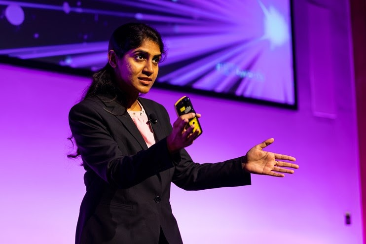

With the coronavirus shutting us down in our houses, online mode is the only way to go. Hence, we would like to proudly announce an Online University-Level Competition to brush up on your presentation skills.

IET NITK brings to you Present Around The Net (PATN), a competition for young professionals, graduates, apprentices and students within the engineering domain to develop and showcase their presentation skills, enhance their knowledge and make invaluable connections.

**Who’s eligible?**

- Anyone in the age group of 18-30 with a technical/engineering background.
- All IET members and non-members are welcome.

**What do you have to do?**

- Deliver a 10 minutes presentation on any engineering or technology-related topic and answer any relevant questions raised by audiences or judges.
- To make it even easier, it is perfectly acceptable to talk about any of your projects, internships, or use any other presentation which you already have.

**Do we have to pay for registering?**

No, registration is absolutely free.

**Are teams allowed to participate?**

No, it is an individual competition.

**What are the perks of participating?**

- The top 3 contestants stand a chance to win prizes worth Rs. 3000.
- All the participants will get participation certificates.
- An invaluable experience that can help your career.

**When and where?**

The event is scheduled for 10th April 2021. It is going to be conducted virtually.

**Where do I register for it?**

Register [for PATN here](https://bit.ly/3u7IufJ).

**Is my college eligible?**

This event is open to all colleges and universities of India. It is not part of the official PATW competition.

**How long is each presentation supposed to be?**

Preferably 8-10 minutes long.
Should not exceed a limit of 10 minutes.

**How many rounds will this event consist of?**

The event comprises a single round.

**What are the topics can I choose to present?**

Any engineering or technology-related topic can be presented.

**How will the order of participants be decided?**

The order of presentation is based on an online randomizer.

**On what basis are the winners decided?**

Based on Slides Deck, Time Management, Audience Impact, Voice modulations, Technical Topic and Content.

**When will the results be announced?**

Results will be announced on the spot.

**Got more questions? Contact us!**

- Palash (9870036171)
- Skanda (9481141528)
