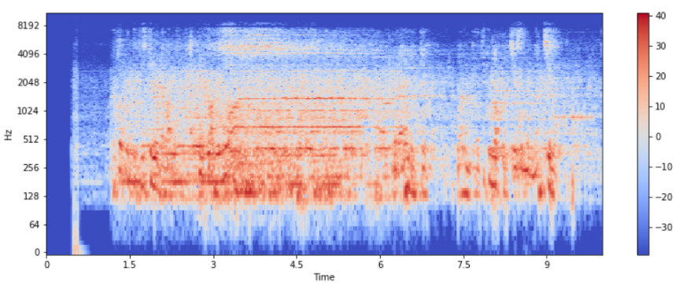

# Built by
- **Attada Ramprasad**
- **Pooja Gayathri Kanala**
- **Sharuf Baig**
- **K Snehith Bhagavan**

# Audio Fingerprinting

## ABSTRACT
Recognizing a song from a large cluster of audio can't be achieved by using brute force to compare an audio sample to every song in the database. In this project we use hashing,a process in which reproducible hash tokens are extracted to save the effort, this method compares the hash values instead of the whole files so that it will be more efficient, Audio fingerprinting is the process of representing an audio signal in a compact way by extracting relevant features of the audio content.The fingerprints from the unknown sample are matched against a large set of fingerprints stored in the database. In this our model we are using mysql as the database.Companies like shazam, phillips, intrasonics and many more use audio fingerprinting for various implementations.

## AUDIO RECOGNITION
Read the audio file recorded and store it into a 2-D array of amplitude against time.The recording can be done using the microphone or the input file can be read from the system itself and saved as an audio file.This process is same for both , adding the audio files to the database as well as for recognising the audio files i.e both training and testing phase.

## Fast Fourier Transform (FFT)
Now we use Fast Fourier Transform (FFT) to change the waveform to frequency domain from time domain.

## Spectrogram
Next step is to perform Short-Term Fourier Transform (STFT) of the audio signal by breaking down the signal into small chunks and performing the Fourier Transform on each of them to generate the spectrogram, which is a visual plot of all three variables amplitude against time and frequency.

## Mapping peaks
The processing is usually carried out on a 2-D array , which stores the STFT coefficients of the file and the peaks, local maxima points of the file, which are mapped by masking.A set of the peak and its neighbour are passed to a hash function to generate a hash. A hash is an encoded string which is unique for each input. An audio fingerprint is generated which is a set of hash values and the offset value(time component of the peak).This value is stored in the database with a unique song_id. After we perform these steps on the known file we can match the audio file.

## Recognise the song
We recognise the song by comparing the hash value from the database.A pair of key-value is appended into an empty dictionary created for each song. Where key is the difference between the database offset and the sample offset and value if the number of repetitions of the matches we get while comparing the hash values. A score is calculated for each song which is the maximum value of ‘value’ in that particular dictionary. The song with maximum score is the best match for the input file and the model returns the song name with the score value.

## Conclusion
The model has been successful in recognizing the song by finding the fingerprints. The further improvements for this model would be to use noise filter techniques, get accurate fingerprints and improve the database.

## RESOURCES
- [https://medium.com/swlh/understanding-audio-fingerprinting-b39682aa3b5f](https://medium.com/swlh/understanding-audio-fingerprinting-b39682aa3b5f)
- [https://ourcodeworld.com/articles/read/973/creating-your-own-shazam-identify-songs-with-python-through-audio-fingerprinting-in-ubuntu-18-04](https://ourcodeworld.com/articles/read/973/creating-your-own-shazam-identify-songs-with-python-through-audio-fingerprinting-in-ubuntu-18-04)